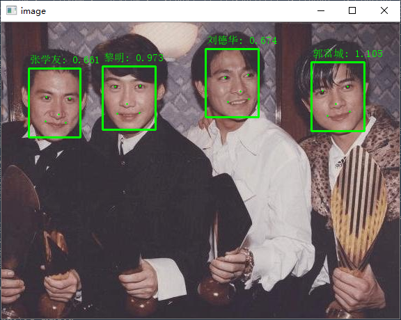

## 概述
本项目可以自动识别图像中的公众人物, 并提供脸部坐标和置信度得分.

目前可识别 4000+ 公众人物, 包括歌星, 演员, 运动员和政要等, 支持名单在不断更新中.

本项目的人脸检测算法和模型来自 [MTCNN_face_detection_alignment](https://github.com/kpzhang93/MTCNN_face_detection_alignment) , 人脸特征提取模型来自 [InsightFace_Pytorch](https://github.com/TreB1eN/InsightFace_Pytorch) . 

## 安装
```
git clone https://github.com/quarrying/quarrying-celebrity-id.git
cd quarrying-celebrity-id
conda create -n celebid python=3.6 -y
conda activate celebid
pip install -r requirements.txt
```

## 用法
参考 [demo.py](demo.py)

## 效果示例


## 参考
- https://github.com/kpzhang93/MTCNN_face_detection_alignment
- https://github.com/TreB1eN/InsightFace_Pytorch
